# Restaurant Poster Reference Library

面向中国餐饮门店的实战海报参考库。当前收录 **59 张用户提供案例**：招聘类 26 张，以及第二大类 **多菜品与招牌菜海报 / Multi-dish & Signature Dish Posters** 33 张。不以模型臆造的“风格词”替代案例证据。

仓库结构参考 [awesome-gpt-image-2](https://github.com/freestylefly/awesome-gpt-image-2) 的“案例 → 分类 → 模板 → 结构化数据”组织方式，但字段、分析与模板均为本仓库重新设计。

## 分类导航

| 分类 | 案例数 | 数据 | 文档 | 模板 |
|---|---:|---|---|---|
| 通用招聘案例 | 6 | [`data/recruitment-cases.json`](data/recruitment-cases.json) | [`docs/recruitment.md`](docs/recruitment.md) | [`docs/templates.md`](docs/templates.md) |
| 品牌招聘基准 | 20 | [`data/brand-recruitment-cases.json`](data/brand-recruitment-cases.json) | [`docs/brand-benchmarks.md`](docs/brand-benchmarks.md) | [`docs/templates.md`](docs/templates.md) |
| 多菜品与招牌菜 | 33 | [`data/multi-dish-signature-cases.json`](data/multi-dish-signature-cases.json) | [`docs/multi-dish-signature.md`](docs/multi-dish-signature.md) | [`docs/templates.md#多菜品与招牌菜海报模板`](docs/templates.md#多菜品与招牌菜海报模板) |

## 招聘案例画廊

| ID | 预览 | 类型 | 核心设计机制 |
|---|---|---|---|
| R001 | 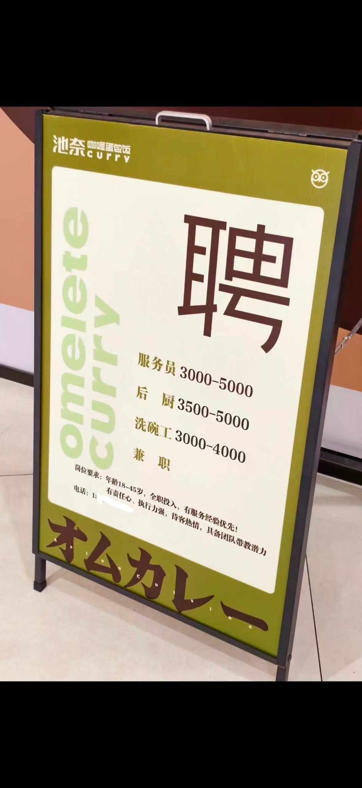 | 商场 A 型水牌 | 单字“聘”建立远距识别，岗位薪资居中排列 |
| R002 | 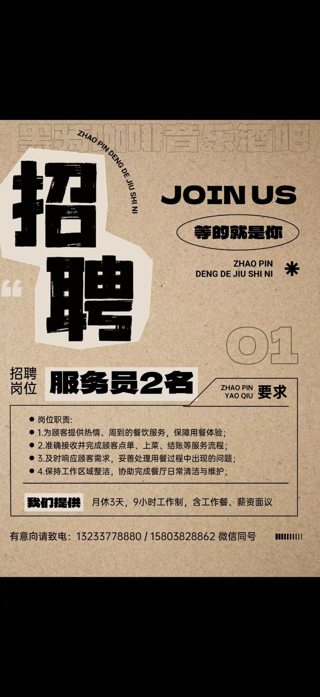 | 牛皮纸编辑海报 | 粗黑招聘字、纸张肌理、框线信息区 |
| R003 | 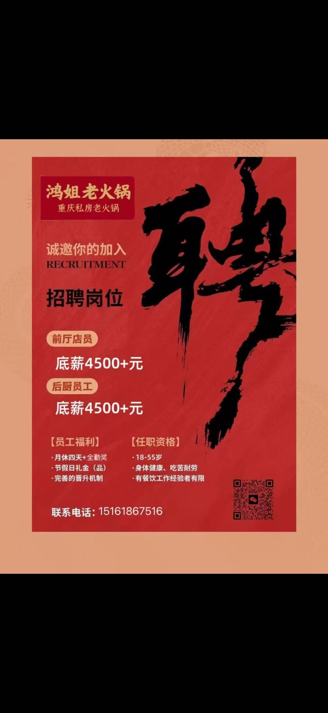 | 红色传统餐饮海报 | 巨型书写字、岗位薪资、福利与资格分区 |
| R004 | 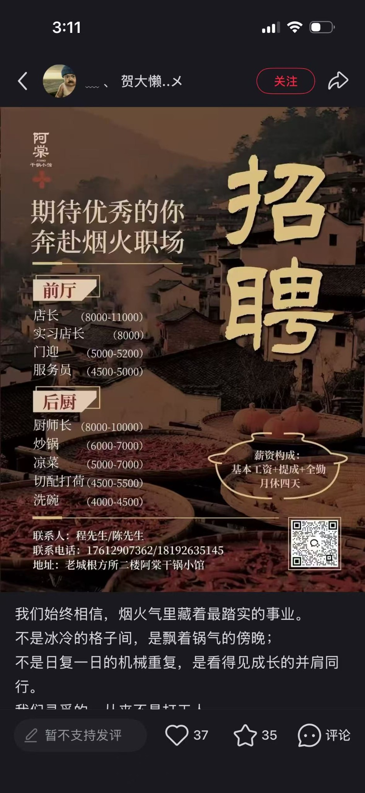 | 场景摄影招聘海报 | 行业环境图、前厅后厨双栏、醒目招聘字 |
| R005 | 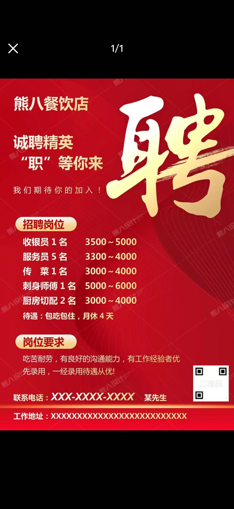 | 连锁餐饮信息表 | 红金主色、岗位薪资表、要求与联系方式 |
| R006 |  | 系列化招聘模板 | 同一视觉系统下的多版式适配 |

## 品牌基准精选

完整的 20 案例索引与权利边界见 [`docs/brand-benchmarks.md`](docs/brand-benchmarks.md)。下列预览只用于说明数据库覆盖的设计机制。

| ID | 预览 | 基准方向 | 核心设计机制 |
|---|---|---|---|
| R007 | 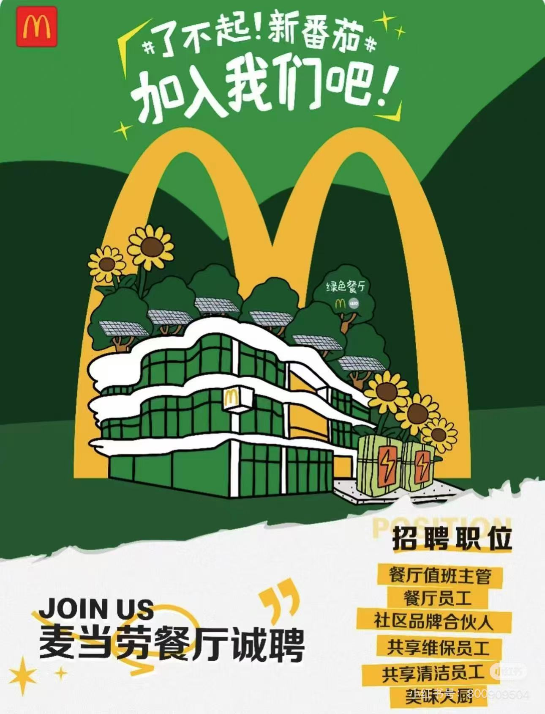 | 品牌 Campaign | 品牌符号作骨架，门店插画＋撕纸信息区 |
| R012 | 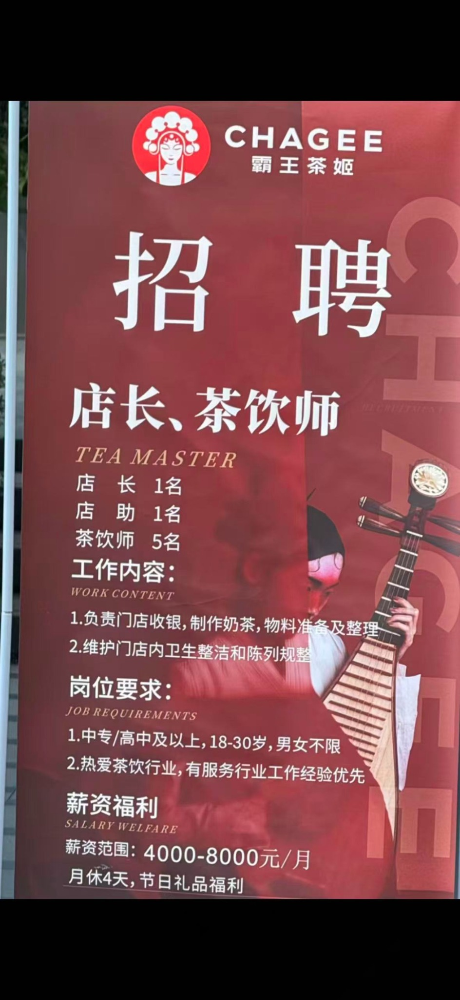 | 门店玻璃海报 | 红色文化图像＋纵向岗位信息 |
| R018 |  | 总部招聘 | 三张编号卡分别回答人群、岗位、福利 |
| R020 | 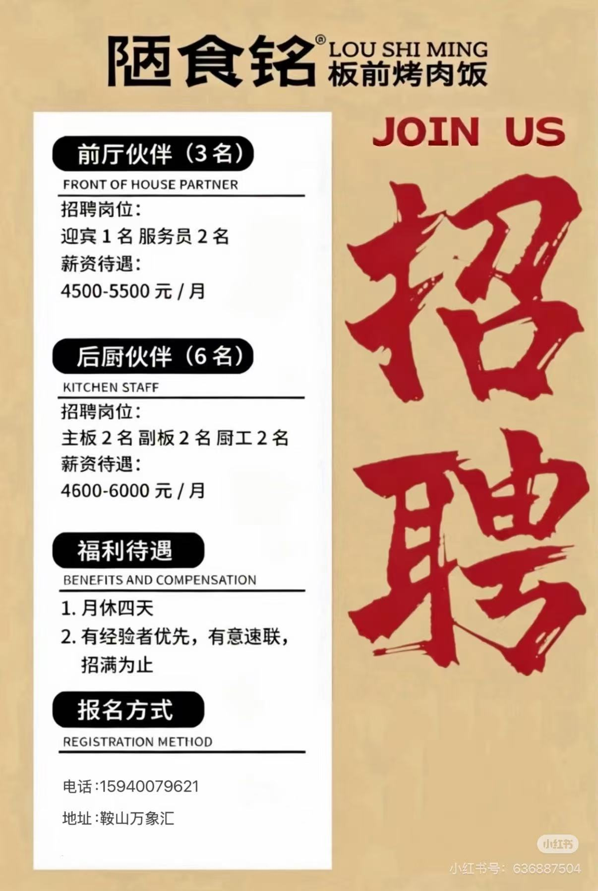 | 传统餐饮 | 左信息轨＋右巨型书写招聘字 |
| R022 | 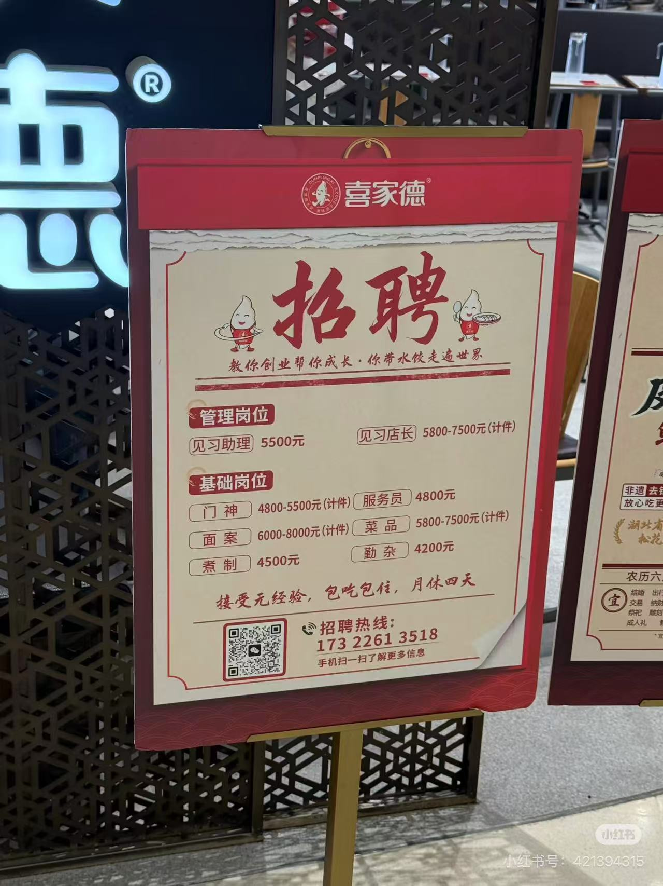 | 门店招聘牌 | 红米色物理框＋岗位分组表 |
| R026 | 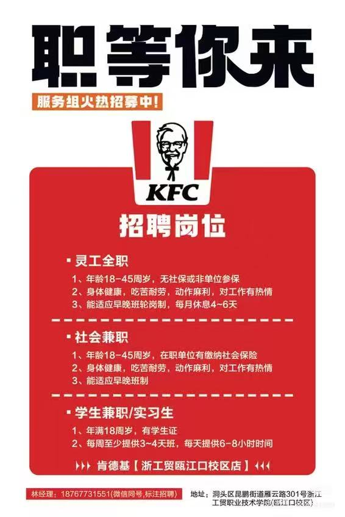 | 高识别门店版 | 超大标题＋单一红色信息模块 |

## 多菜品与招牌菜精选

完整的 33 案例分析见 [`docs/multi-dish-signature.md`](docs/multi-dish-signature.md)。图片中的平台 UI、黑边、水印、商标和原文案均不视为可复用设计元素。

| ID | 预览 | 版式家族 | 核心设计机制 |
|---|---|---|---|
| D001 | 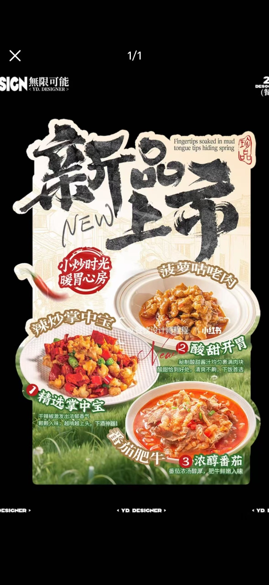 | 主菜＋辅菜 | 书法标题＋三菜编号阶梯 |
| D002 |  | 场景化静物 | 焦木、陶锅、藤篮构成前中后景 |
| D003 | 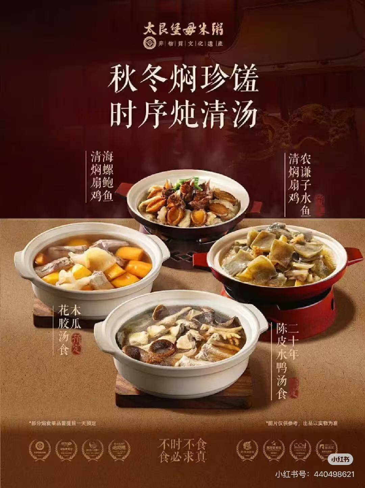 | 等权菜品矩阵 | 四只同类锅具组成菱形阵列 |
| D006 | 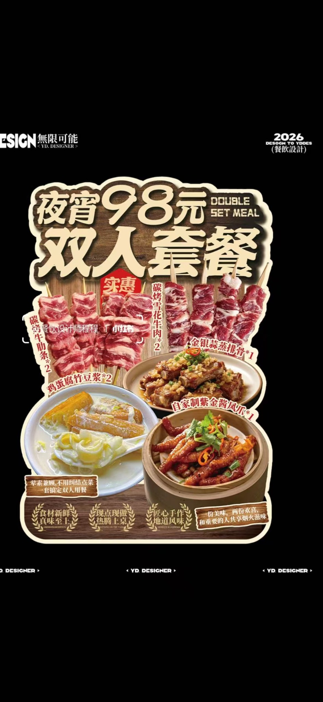 | 套餐堆叠 | 巨型价格＋串类量感＋菜盘交叠 |
| D010 | 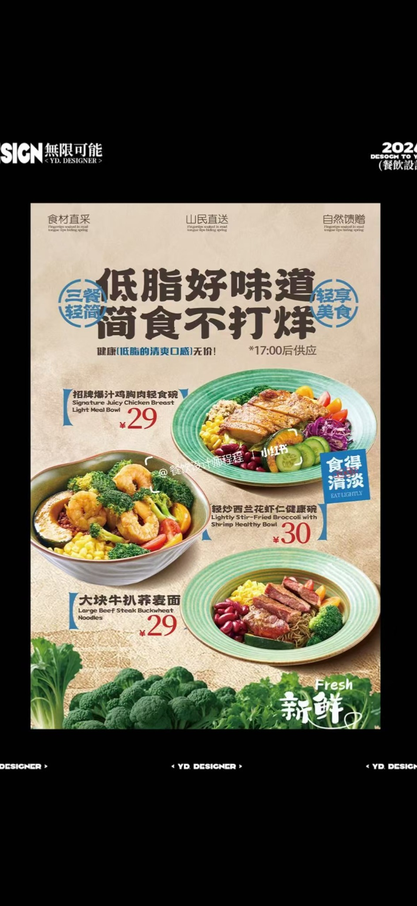 | 价格菜单 | 三盘菜沿 Z 字路径与价格成组 |
| D018 | 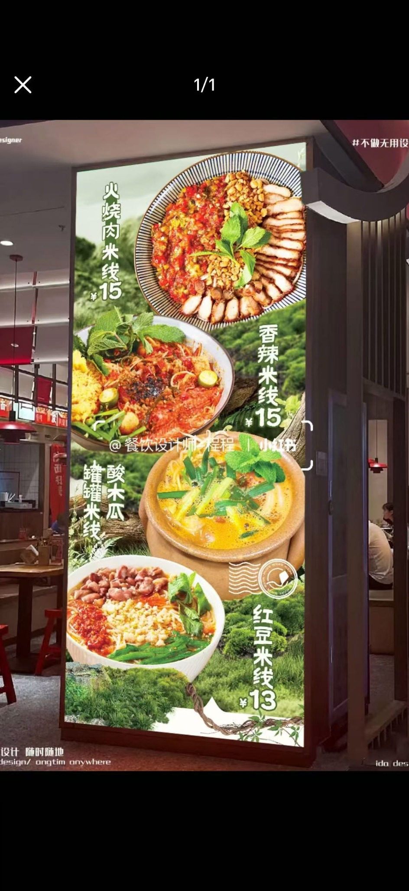 | 实体灯箱 | 四碗米线沿窄幅纵向导览 |
| D020 |  | 地域拼贴 | 黑白地标＋彩色主食与小吃组合 |
| D026 | 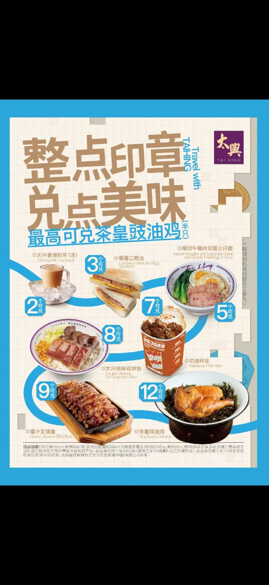 | 品牌菜单 | 蓝色路线串联六个兑换商品模块 |
| D031 |  | 质量反例 | 保留疑似生成式乱码，用于人工质检规则 |
| D033 | 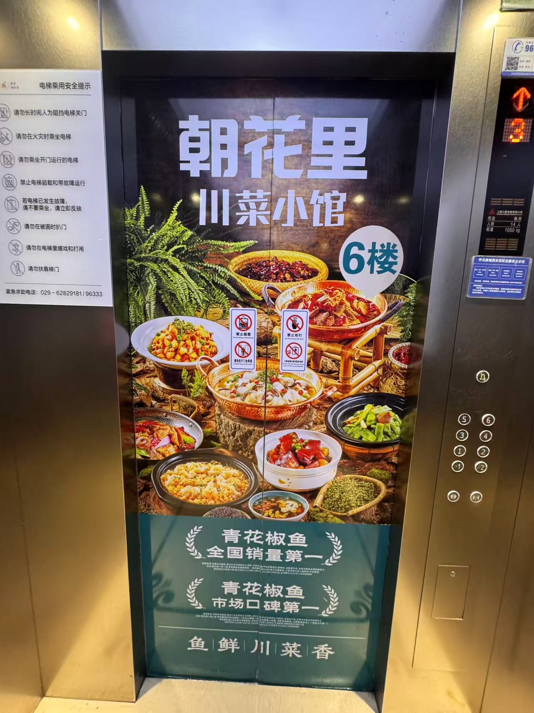 | 实体应用 | 电梯门中缝安全区＋多菜宴席堆叠 |

## 铁毅祥品牌文字锁定

- 品牌标准名：**铁毅祥河洛面**
- 品类标准描述：**河南郏县河洛面**
- 招聘岗位：**收银员、服务员、厨房杂工**
- 薪资写法：**工资面议**
- 联系电话：**15093777772、18317666660**

品牌名称必须逐字使用“铁毅祥河洛面”，不接受任何近形字、繁体字或相似面食品类名称替代。

## 使用方法

1. 先确认业务属于招聘，还是多菜品/招牌菜推广。
2. 只选择一个主案例结构，不要把多种案例的装饰系统全部混合。
3. 读取该案例的 `designEngine`、`layoutZones` 和 `reusableElements`；菜品类还需读取 `dishHierarchy` 与 `foodImageTreatment`。
4. 若选择品牌基准案例，先读取 `nonReusableIdentityAssets`，明确禁止复用的 Logo、商标和专属插画。
5. 将业务变量填入 [`docs/templates.md`](docs/templates.md) 的对应模板。
6. 运行 `npm run validate` 检查图片路径、哈希、必要字段、案例路由和权利状态。

## 权利说明

仓库内图片是用户提供的实战参考截图，来源与商业授权状态尚未核验。品牌案例出现商标也不代表已确认由品牌官方发布。图片仅标记为 `reference-only`，不得据此推定可公开再分发或直接商用。公开发布到 GitHub 前，应补充原作者、原链接和许可信息，或将原图替换为已获授权的缩略图。
